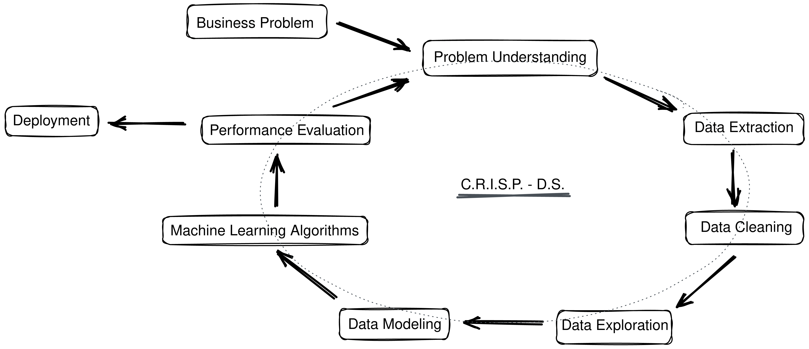
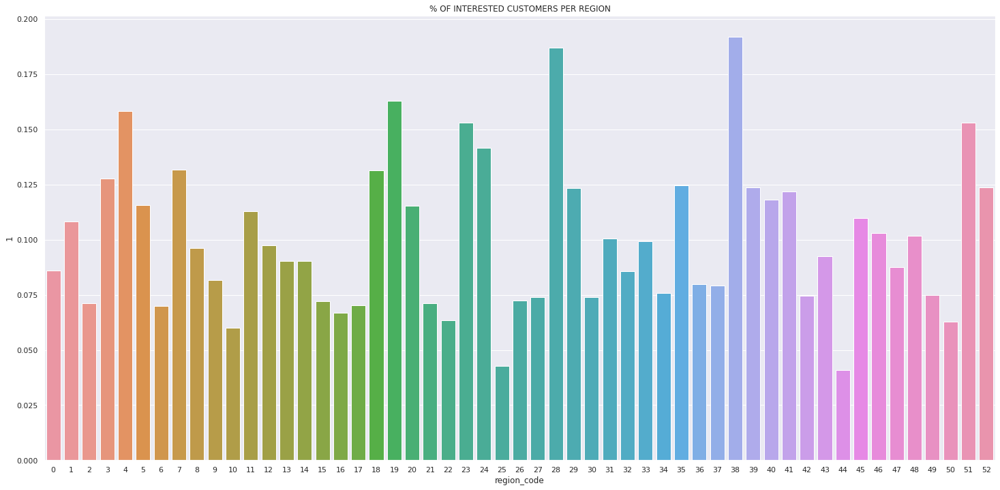
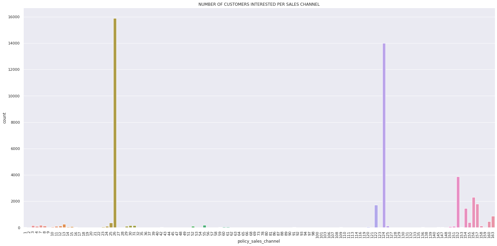
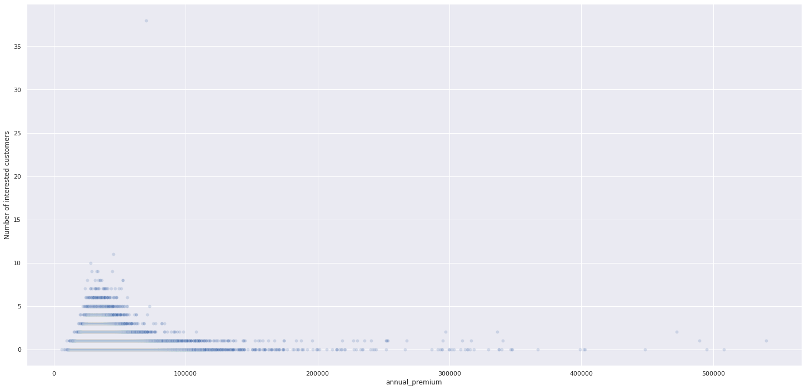
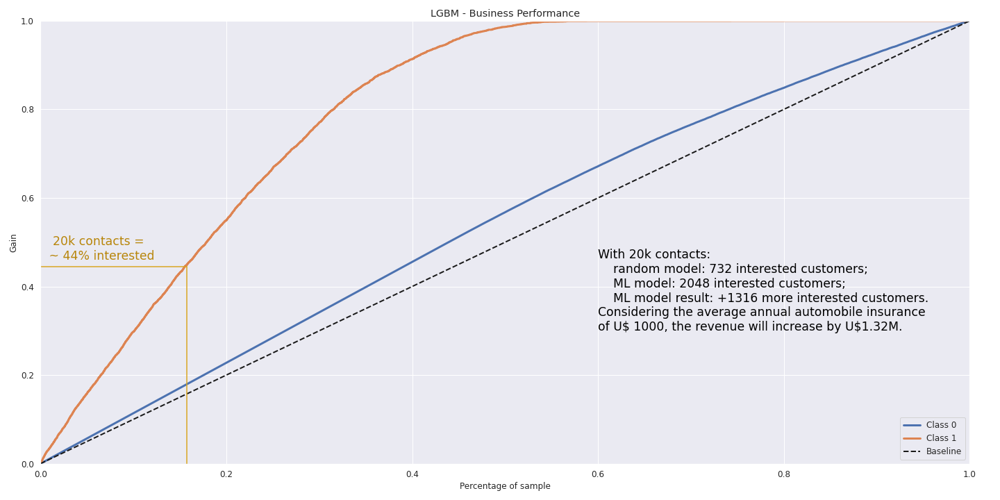
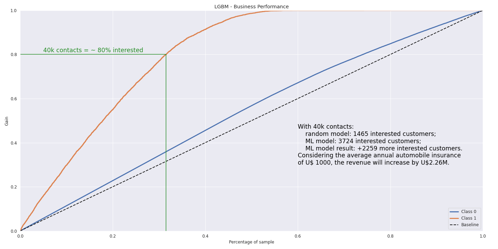
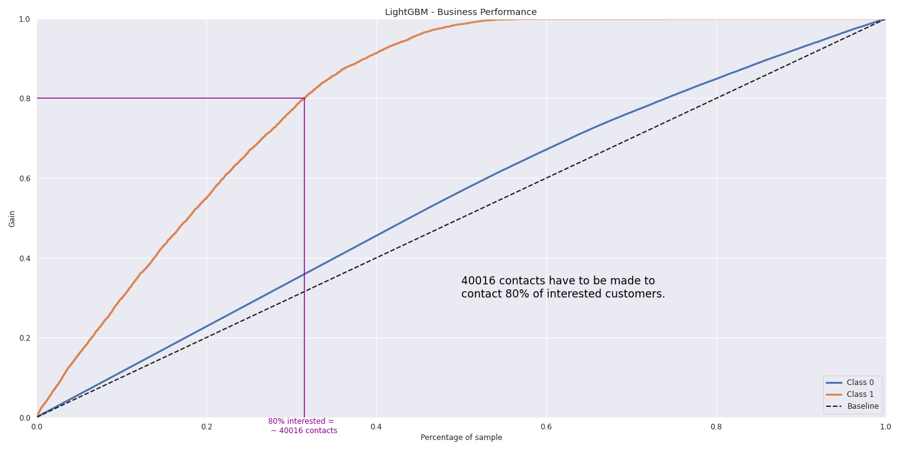
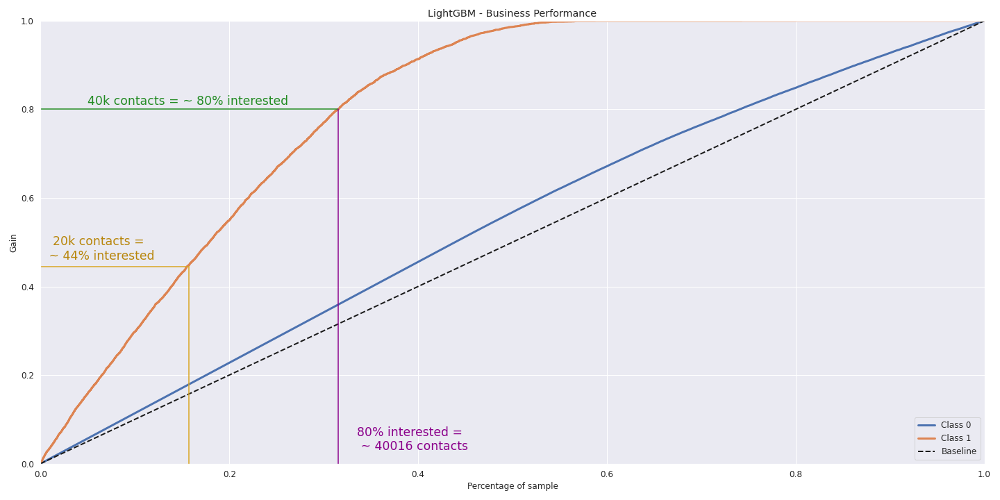
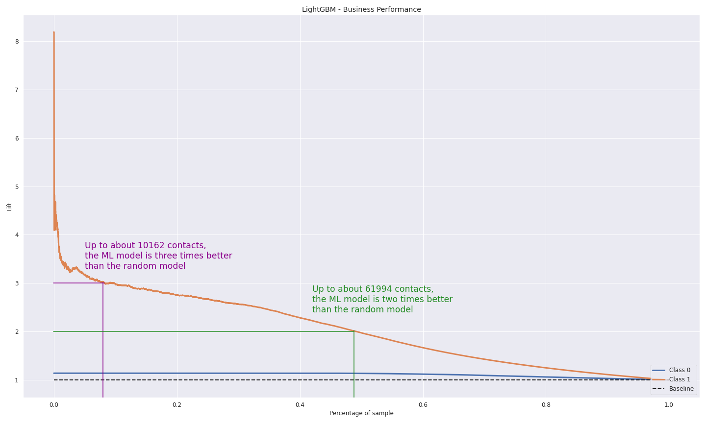

#  - BUSINESS UNDERSTANDING

## What is the company?

    Insurance All

## What is its business model?

    Insurance All is an insurance company that sells health insurance for its clients. The insurance business model works this way. 

    The insurance company requires a payment (called "premium") from the customer to guarantee compensations in case of illnesses, health treatments and any other conditions specified on the contract.

    So, let's say the premium costs 5,000 and the guarantee is up to 100,000. In this case, the customer has an assurance that, for example, if he needs a health treatment of 20,000, the insurance company will pay for it (as this value is less than 100,000 guarantee).

    Note that the insurance company has not only one customer but rather hundreds, or even thousands, of them. And, the company also knows, by statistical means, that only a few of them will require a guarantee higher than the premium. Therefore, the company attests that, on average, it will make money, even though it may lose money with a few customers.
    
    
## What is the business problem the company is facing?

    Insurance All is a health insurance company and its products team is analyzing the possibility of offering a new product, automobile insurance, for its health insurance clients.

    Similar to its health insurance, customers of this new insurance plan would have to pay an annual plan to be insured by Insurance All in case of an eventual car accident or damage.

    Last year, Insurance All surveyed approximately 380.000 clients on their purchasing interests in this new automobile insurance. All clients in this survey had an 'interested' or 'not interested' response to this new car insurance product and answers were stored in a database alongside other information from its clients.

    The product team chose 127.000 new clients that didn't answer the last survey to the new automobile insurance product offering. The products team will make these offers by phone call, but they can make only 20.000 phone calls in the campaign.    

## What is the business solution that this project has to deliver?

    In this business context, you, as a data science consultant, has to develop a model that predicts if a client would be (or would not be) interested in the automobile insurance product.
    
    With this model, the products team expects to prioritize clients that would be interested in the new product and so optimize sales campaigns by making phone calls only for the interested clients.
    
    As a final consultant product, you have to make a report with the following analyses:
    
        1. Top insights about the most relevant features of automobile insurance interested clients 
    
        2. Making 20.000 phone calls, what percentage of interested clients the sales team will get in contact with?
    
        3. If the sales team expands its capacity to make 40.000 phone calls, what is the percentage of interested clients the sales team will get in contact with?
    
        4. How many phone calls does the sales team has to make to contact 80% of automobile insurance interested clients?

REFERENCES:
    
  https://www.kaggle.com/anmolkumar/health-insurance-cross-sell-prediction/metadata

  https://sejaumdatascientist.com/como-usar-data-science-para-fazer-a-empresa-vender-mais/

# - BUSINESS ASSUMPTIONS

**HYPOTHESIS**

According to the database information, **Annual_Premium** is the amount customer needs to pay as premium in the year. So, just to make it clearer, it refers to the value of the health insurance paid and not the automobile insurance offer.

Based on a survey on the references below, the **average cost of car insurance** was assumed as $1,000 per year. As most references below estimations are higher, the revenue estimations for this project are somewhat pessimistic.

References:

https://www.bankrate.com/insurance/car/average-cost-of-car-insurance/

https://www.policygenius.com/auto-insurance/learn/how-much-is-car-insurance/

https://www.businessinsider.com/personal-finance/average-cost-of-car-insurance

# - SOLUTION STRATEGY

## Step 01. Data Extraction:
    Using SQL, extract data from a PostgreSQL database on Amazon AWS cloud. Then, analyse the entity-relationship diagram and merge different tables.

## Step 02. Data Description:
    Check column names, number of rows in the table, data types for each column and number o NA values (not-available values). Then use statistics metrics to identify data outside the scope of business.

## Step 03. Feature Engineering:
    Create a hypothesis list to check on the fifth step (EDA). Then apply data transformations on the required columns.

## Step 04. Data Filtering:
    Filter rows and select columns that do not contain information for modelling or do not match the scope of the business.

## Step 05. Exploratory Data Analysis:
    Analyse each variable alone and then the relationship among variables. Then, explore the data further to validate the hypothesis list and raise insights.

## Step 06. Data Preparation:
    Split data into train and validation and test. Then, prepare data so that the Machine Learning models can more easily learn and perform more accurately.

## Step 07. Feature Selection:
    Select the most significant attributes for training the model.

## Step 08. Machine Learning Modelling:
    Test different Machine Learning models and select the one with the best performance in ranking customers according to their interest.

## Step 09. Hyperparameter Fine Tuning:
    Choose the best values for each parameter of the selected ML model.

## Step 10. Performance Evaluation and Interpretation:
    Check the learning performance and the generalization performance of the ML model (overfitting vs underfitting). Then convert the ML performance into business results.

## Step 11. Deployment:
    Create an API (Application Programming Interface) to make predictions available on internet requests. Then, for the final user, create a google sheet that gets predictions directly from the API by just clicking a button.

# - TOP 3 INSIGHTS

## - H1. Considering people interested in automobile insurance, the number of customers interested in automobile insurance has a large variation according to customers' region.

> H1 IS TRUE. Different regions have a large variation in terms of the number of interested customers.
    

    
**Suggestion**: investigate further as there may be better regions to focus on sales.

## - H2. Different sales channels have a large variation in terms of the number of interested customers.

> H7 IS TRUE. The number of interested customers may vary largely among sales channels.

 

**Suggestion:** investigate further as there may be better channels to focus on sales.

## - H3. Considering people interested in automobile insurance, most of them contracted cheaper health insurance in the past.

> H3 IS FALSE. The number of interested customers doesn't always decrease with increasing annual health insurance premium of past contracts. There is a region of annual premium about 35000 where, the higher the annual premium, the higher the number of interested customers.

 

# - BUSINESS RESULTS

## Making 20.000 phone calls, what percentage of interested clients the sales team will get in contact with?

## If the sales team expands its capacity to make 40.000 phone calls, what is the percentage of interested clients the sales team will get in contact with?

## How many phone calls do the sales team has to make to contact 80% of automobile insurance interested clients?

## Compiled business results

# - RANDOM MODEL vs ML MODEL

# - DEPLOYMENT

**Google Sheet**

A Google Sheet was created so that the sales team can easily check the likelihood of a customer being interested in automobile insurance. With this solution, the sales team can also easily sort customers according to their interests.

You can check how to make predictions via this spreadsheet by watching the following video:
https://youtu.be/l7lt7gji7oY

# - CONCLUSIONS

As this is my first Data Science project, it took me a while to go from the very beginning till the very end of the project (actually, it took me about three weeks). 

However, **even within just a few weeks, we can easily see that Data Science projects could increase the company revenue in expressive numbers**.

# - LESSONS LEARNED

**It's important to focus on business results and don't get lost in using different tools.**

**It's important to focus on how the business results will be improved, not what ML models will be applied.**

**On the first project cycle, it's important to keep things simple and not try to get the best solution because this can only be achieved through many project cycles.**

# - NEXT STEPS TO IMPROVE

**Google sheet**: improve user interface and make checkings on data input by the users.

**Features**: try different variables, scalers and encodings so that ML performance improves.

**API**: improve the interaction between API and spreadsheet so that users get more intuitive messages in case of errors.

**Data**: improve the quality of the data. One solution here may be to gather more data about the customers, especially new variables. 

**Code**: review the whole code once more to make it clearer and more efficient (faster and less resource-intensive).
